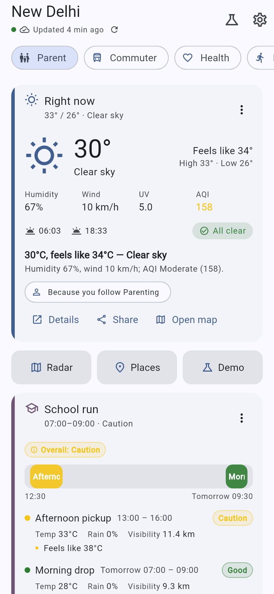
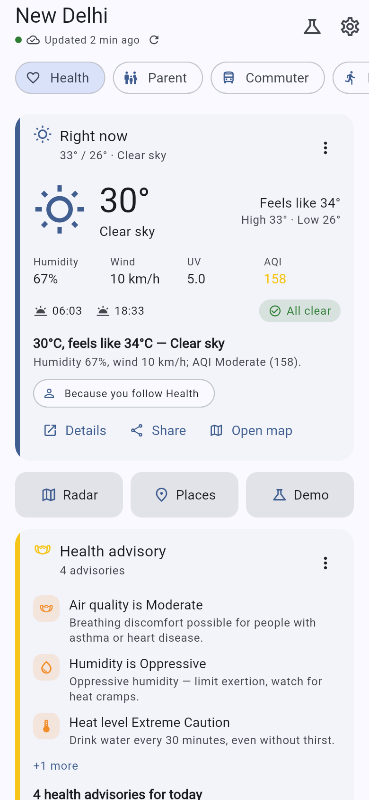
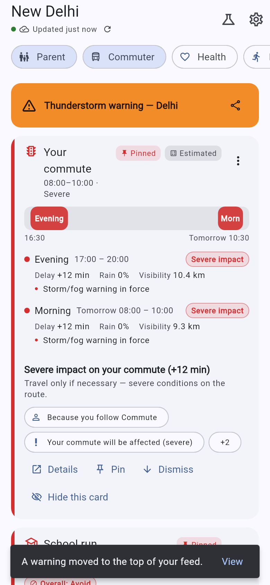
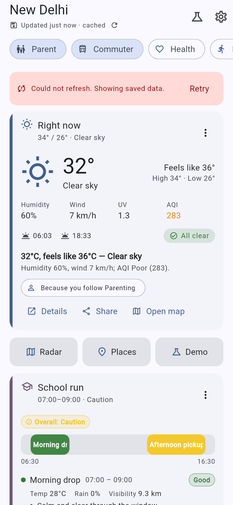
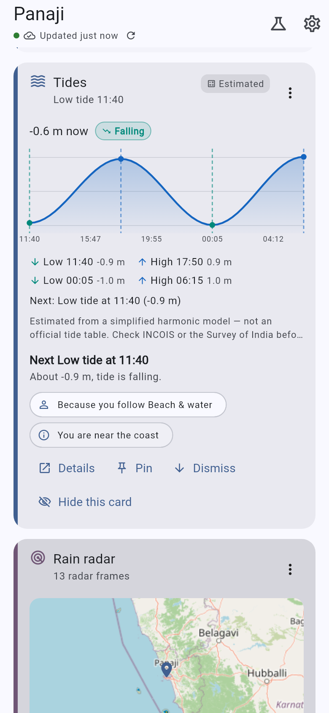

# Mausam Personalized — a persona-aware home screen for IMD's *Mausam* app

[](https://github.com/Shreyansh303/team_mausam_sih_2026/actions/workflows/backend.yml)
[](https://github.com/Shreyansh303/team_mausam_sih_2026/actions/workflows/flutter.yml)

**Smart India Hackathon 2026 · PS 26076 (MoES / India Meteorological Department) · Team Mausam**

A working prototype of a **personalized homepage** for the Mausam mobile app. A FastAPI backend
pulls real weather, air-quality and marine data, derives persona-specific insights (best running
hours, school-run verdict, tide window, frost risk, packing list…), and runs a **personalization
engine** that scores and ranks 33 card types for the user in front of it. A Flutter app renders the
ranked cards, explains *why* each one is there, learns from taps and dismissals, re-ranks live when
a warning is pushed over a WebSocket, works offline from cache, and speaks English and Hindi.

> **Disclaimer.** This is a **Team Mausam prototype built for SIH 2026 — it is not an IMD product
> and is not affiliated with or endorsed by IMD or MoES.** It uses IMD's public colour conventions
> for warnings but no IMD logos or branding. The Android app id is `com.teammausam.mausam_app` and
> its display name is "Mausam Personalized (Team Mausam prototype)". Forecast data comes from
> Open-Meteo unless an IMD-whitelisted deployment is configured (see the IMD integration path in
> [§13 Future Scope](#13-future-scope) and
> [`backend/README.md`](backend/README.md#imd-integration-needs-whitelisting)); anything modelled
> is labelled **Estimated**.

---

## 1. Project Information

- **Project Title:** Mausam Personalized — a persona-aware, self-adapting home screen for the Mausam app
- **PS ID:** 26076
- **PS Title:** Development of personalized homepage for 'Mausam' mobile application
- **Organisation:** Ministry of Earth Sciences (MoES) / India Meteorological Department (IMD)
- **Category:** Software
- **Theme:** Smart Automation
- **Team:** Team Mausam
- **Repository URL:** <https://github.com/Shreyansh303/team_mausam_sih_2026>

**Team members** (contributions are visible in the git history)

- Shreyansh Jain
- Anushka Gupta
- Dhruv Sihag
- Ashish Kumar
- Shivangi
- Yash Panchal

## 2. Problem Statement

**Development of personalized homepage for 'Mausam' mobile application** (SIH 2026 · PS 26076 ·
MoES / India Meteorological Department):

- Health-conscious users: Highlight Air Quality Index (AQI), pollen count, UV index, and humidity levels to help users manage allergies, asthma, or skin sensitivity.
- Outdoor fitness enthusiasts: Show sunrise/sunset times, 'best running hours,' wind speed, and heat alerts to optimize workout planning.
- Beachgoers & surfers: Display sea conditions, tide timings, wave height, and water temperature for safe and enjoyable beach activities.
- Travelers: Provide quick access to saved destinations, severe weather alerts for flights, and packing suggestions (e.g., 'Carry a raincoat in London').
- Parents & families: Emphasize school commute conditions, rain alerts, and severe weather warnings to plan daily routines.
- Agriculture & gardeners: Show soil moisture, rainfall predictions, frost alerts, and seasonal planting guidance.
- Commuters: Integrate weather with traffic updates, visibility conditions, and alerts for storms or fog that affect travel.
- Event planners: Offer extended forecasts, probability of rain, and 'comfort index' for outdoor gatherings or weddings.

A single fixed home screen cannot serve these eight groups at once: the soil moisture a farmer needs
at dawn is noise to a commuter, and the AQI a parent checks before the school run is buried under a
7-day forecast a surfer never reads. What matters also changes with the hour, the season, the coast
and any active warning — so the screen has to be ranked per person and per moment, and say *why*.

## 3. Proposed Solution

A **server-driven, ranked home screen**. The backend knows the user's personas, the location and the
live conditions; it scores every eligible card as *relevance × context + urgency + learning*, orders
them, attaches human-readable reasons, localizes the copy and returns the finished screen. The app
renders what it is given, reports what the user did, and re-fetches when the server says something
changed. Concretely:

**Eight personas** (users pick 1–3; the first is primary, everyone also gets an implicit `base`):

| id | Persona | What it surfaces |
|---|---|---|
| `health` | Health-conscious | AQI (CPCB scale), pollen, UV, humidity, health advisory |
| `fitness` | Outdoor fitness | best workout windows, sun times, wind, heat alert |
| `beach` | Beachgoers & surfers | sea conditions, tides, water temperature |
| `traveler` | Travellers | saved destinations, flight-risk alerts, packing suggestions |
| `parent` | Parents & families | school-commute windows, rain alert, severe warnings |
| `agriculture` | Agriculture & gardeners | soil moisture, rainfall outlook, frost alert, planting guidance |
| `commuter` | Commuters | commute windows + traffic, visibility, storm/fog alert |
| `event_planner` | Event planners | 14-day forecast, rain probability for a date, comfort index |

- **Persona-aware ranking.** Each of the 33 card types has an affinity per persona; the engine
  blends persona relevance with live urgency and returns an ordered home screen, not a fixed list.
- **Context-aware.** Time of day, weekday/weekend, IMD season, coastal vs inland, elevation and
  active warnings all move cards. A parent at 07:30 on a weekday sees *School run* first; the same
  parent at 22:00 does not.
- **Explainable.** Every card carries up to four reasons ("Because you follow Parenting",
  "Early-morning window", "AQI is Very Poor right now"); long-press opens *Why am I seeing this?*
- **Learning.** Taps, expands, pins and dismissals are sent back and adjust the score immediately —
  a few dismissals demote a card out of the feed, a pin pins it (see step 6 of the walk-through
  in §12).
- **Live re-rank.** An orange/red warning pushed from the admin console reaches every connected
  client over `/ws/alerts` in milliseconds; the app shows a banner, re-fetches and animates the
  warning card to the top.
- **Offline.** The last home payload is cached on device; a cold start with no network still renders
  with a freshness chip ("Updated 12 min ago"), falling back to a bundled sample payload.
- **Multilingual.** English and Hindi are complete (604 backend strings each, plus 353 app-chrome
  strings); Marathi, Tamil and Bengali are partial (54 backend / 69 app keys) with per-key fallback
  to English. Card copy, advice, reasons, crop actions and date labels are localized server-side.
- **Honest data.** Tides, pollen and traffic are modelled — they carry `"source": "estimated"` and
  the UI shows an **Estimated** chip. Estimates are never presented as observations.

## 4. Key Features

- 33 card types covering every bullet of the problem statement, each with a persona affinity, a
  data precondition, an insight rule and an urgency rule (`docs/02_CARD_CATALOG.md`).
- Deterministic scoring engine: `0.5 · relevance · context + 0.5 · urgency + learning`, fully
  unit-tested, same input → same screen (`docs/03_PERSONALIZATION_ENGINE.md`).
- Urgency beats preference: any card with urgency ≥ 0.8 (an orange/red warning) is pinned above
  everything the user has chosen.
- Context multipliers for time of day, weekday/weekend, IMD season and coastal/inland gating —
  tides never show at midnight or inland.
- "Why am I seeing this?" sheet: up to four localized reasons per card, plus pin / hide / show-less actions.
- Learning loop: engagement events batched to `POST /events`, blended as `0.25 · tanh(x/8)` — bounded,
  so taps never outrank a warning.
- Live re-rank over `/ws/alerts`: banner plus animated card move when a warning affecting the user is issued.
- Offline-first: last `/home` payload cached on device with a freshness chip; bundled sample as last resort.
- Low-bandwidth mode (`lite=1`, 13.5 KB) and accessibility: large text, screen-reader labels, ≥ 48 dp targets.
- Server-side localization: English and Hindi complete; Marathi, Tamil, Bengali partial with per-key fallback.
- Honest data: modelled tides, pollen and traffic carry `"source": "estimated"` and an **Estimated** chip.
- Admin demo console: ten scenario overlays (heatwave, cyclone, dense fog, frost…), demo clock, warning push.
- Android home-screen widget (4x1 / 4x2) showing the hero reading and the top pinned card.
- Provider chain IMD → Open-Meteo → estimated, every value recording its `source`; the IMD client is ready.

## 5. Technology Stack

- **Mobile app:** Flutter (stable 3.47.x) · Riverpod · go_router · Dio · flutter_map with OSM
  tiles · fl_chart · intl/ARB localization · JSON file cache · WebSocket client · Android
  app-widget (Kotlin).
- **Backend:** FastAPI on Python 3.13 · Pydantic v2 · httpx · SQLAlchemy 2 · JWT (HS256) with
  guest tokens and a demo OTP (`123456`) · pure-Python ranking engine · optional logistic-regression
  ranker behind `ENGINE_ML=1`.
- **Data & storage:** SQLite by default (`backend/data/mausam.db`), PostgreSQL via `DATABASE_URL`;
  in-process TTL cache (forecast 10 min, air 15 min, marine 30 min, geocode 24 h), Redis via
  `REDIS_URL`.
- **Live alerts:** WebSocket `/ws/alerts` (demoable, no Firebase project needed); Firebase Cloud
  Messaging implemented server-side as the production transport (`docs/08_PUSH_NOTIFICATIONS.md`).
- **Data sources:** IMD `current_wx_api` / `nowcastapi` / `warnings_district_api` / `aws_data_api`
  (need IP/domain whitelisting; return `401` otherwise) · Open-Meteo forecast, air quality, marine
  and geocoding (keyless) · BigDataCloud reverse geocoding (keyless) · RainViewer radar (keyless) ·
  optional CPCB via data.gov.in and TomTom traffic (free keys; **estimated** without them).
- **Deployment & CI:** Docker + `infra/docker-compose.yml` · Render free tier via
  `infra/render.yaml` · GitHub Actions — `backend.yml` runs the offline pytest suite,
  `flutter.yml` runs analyze/test, builds `app-release.apk` as an artifact and builds web.

## 6. Architecture

```text
┌──────────────── Flutter app (Android / iOS / web) ─────────────────┐
│ Onboarding → Home (ranked cards) → Detail pages → Map → Places      │
│ Riverpod · Dio · JSON file cache (offline) · WS client · ARB i18n   │
└──────────────▲──────────────────────────────────────▲──────────────┘
               │ REST  /api/v1  (JSON, < 60 KB)        │ WS /ws/alerts
┌──────────────┴──────────────────────────────────────┴──────────────┐
│ FastAPI backend                                                     │
│  api/       health · locations · weather · auth · me · home ·       │
│             events · admin · ws                                     │
│  engine/    catalog (33 cards, affinities, gates, multipliers)      │
│             → context → scoring → explain → learning → builders     │
│  services/  snapshot assembly + derived metrics (CPCB AQI, comfort, │
│             workout windows, school run, commute, frost, packing,   │
│             planting, tides*, pollen*, traffic*)      *estimated    │
│  providers/ IMD (whitelist-aware) → Open-Meteo → scenario/mock      │
│             + RainViewer radar + geocoding                          │
│  core/      TTL cache · SQLite (Postgres via env) · JWT · i18n      │
│  static/    admin demo console (scenarios, demo clock, push warning)│
└─────────────────────────────────────────────────────────────────────┘
```

**Request path:** `GET /home` → snapshot (cached upstream calls) → derived metrics → engine
(relevance × context + urgency + learning) → localized card payloads → `pinned` / `hero` / `cards` /
`more_cards`. Measured on an M1 MacBook Air: warm `/home` **2 ms** server-side, **~15 ms** on the
first request for a location (snapshot cache cold), payload **34.5 KB** (**13.5 KB** under `lite=1`)
against the < 60 KB / < 400 ms p95 targets in `docs/01_ARCHITECTURE.md`. The app never computes
ranking itself, so IMD could add or reorder a card **without an app release**.

Full description: [`docs/architecture.md`](docs/architecture.md). Specifications:
[`docs/01_ARCHITECTURE.md`](docs/01_ARCHITECTURE.md) (stack, data sources, deployment),
[`docs/03_PERSONALIZATION_ENGINE.md`](docs/03_PERSONALIZATION_ENGINE.md), [`docs/04_API_CONTRACT.md`](docs/04_API_CONTRACT.md),
[`docs/05_BACKEND_SPEC.md`](docs/05_BACKEND_SPEC.md) and [`docs/06_MOBILE_SPEC.md`](docs/06_MOBILE_SPEC.md).

## 7. Repository Structure

```text
README.md                     project overview (this file)
SUBMISSION_GUIDE.md           how this repository maps to the SIH submission template
LICENSE                       MIT
requirements.txt              pointer to backend/requirements.txt
submission/
  PRESENTATION.md             the presentation files, slide by slide, and the viewer link
  DEMO.md                     link to the demo video and what it shows
  TeamMausam_SIH2026_Presentation.pptx  the final 6-slide SIH deck
  TeamMausam_SIH2026_PS26076.pptx       companion deck built from docs/07_PITCH.md
assets/screenshots/           63 app screenshots; README.md there indexes them
docs/
  architecture.md             reviewer-facing architecture overview
  RUNNING.md                  long-form run guide for every platform
  DEVIATIONS.md               where the implementation deviates from the numbered specs
  00_VISION.md                problem statement, personas, product principles, demo script
  01_ARCHITECTURE.md          stack decisions, data sources (probed), deployment
  02_CARD_CATALOG.md          all 33 cards: affinities, data, insight + urgency rules
  03_PERSONALIZATION_ENGINE.md  scoring formulas, explainability, learning
  04_API_CONTRACT.md          REST + WebSocket contract (normative)
  05_BACKEND_SPEC.md          FastAPI structure, providers, derived-metric formulas
  06_MOBILE_SPEC.md           Flutter structure, screens, renderers, offline, i18n, widget
  07_PITCH.md                 SIH idea-presentation content (problem → future scope)
  08_PUSH_NOTIFICATIONS.md    FCM push design: transport swap, message schema, device registry
  09_SIH_DECK_CONTENT.md      slide-by-slide content for the finale deck
  10_IMPACT_NUMBERS.md        sourced external statistics for the impact slide
  QA_REPORT.md                end-to-end walk of the demo script — verdict PASS
  SETUP_WINDOWS.md            Windows toolchain setup (no admin rights)
  fixtures/                   ten real /home payloads (8 personas + severe + coastal)
backend/                      FastAPI service (Python 3.13) — see backend/README.md
app/                          Flutter app (package mausam_app)
infra/                        docker-compose.yml, render.yaml
scripts/                      toolchain setup + optional Android emulator (.ps1 and .sh)
.github/workflows/            CI: backend pytest (offline) · flutter analyze/test/APK/web
```

**What goes where?**

| Item | Location |
|---|---|
| Source code | `backend/` (FastAPI) and `app/` (Flutter) |
| Architecture / technical documentation | `docs/` |
| Screenshots | `assets/screenshots/` |
| Final PPT | `submission/TeamMausam_SIH2026_Presentation.pptx` |
| Demo video link | `submission/DEMO.md` |
| Project overview | `README.md` |
| Deviations from spec | `docs/DEVIATIONS.md` |
| QA evidence | `docs/QA_REPORT.md` |

## 8. Final Presentation

The final deck is in the repository:
[`submission/TeamMausam_SIH2026_Presentation.pptx`](submission/TeamMausam_SIH2026_Presentation.pptx)
(6 slides, 7.1 MB) — title and problem statement, solution overview, technical approach,
feasibility and viability, impact and benefits, research and references.

A companion deck is kept alongside it:
[`submission/TeamMausam_SIH2026_PS26076.pptx`](submission/TeamMausam_SIH2026_PS26076.pptx)
(6 slides with speaker notes, generated from [`docs/07_PITCH.md`](docs/07_PITCH.md); finale content
in [`docs/09_SIH_DECK_CONTENT.md`](docs/09_SIH_DECK_CONTENT.md)).

External viewer link (Google Drive), holding the same final deck:
<https://drive.google.com/drive/u/0/folders/1w29cHLEjk3sNfNN1hwYWn3AOmVcMml2t> — see
[`submission/PRESENTATION.md`](submission/PRESENTATION.md) for a slide-by-slide summary.

## 9. Demo Video

A demo of the prototype: <https://www.youtube.com/watch?v=dAnlxq_2jj8>

See [`submission/DEMO.md`](submission/DEMO.md) for the demo script the recording follows, step by
step.

## 10. Screenshots / Prototype Photos

**The same morning, three of the eight personas** — one backend, one location, one moment; only
the selected personas change:

| Parent & families | Health-conscious | Agriculture |
|---|---|---|
|  |  |  |
| *School run* and commute first | AQI, pollen, UV, humidity first | soil moisture, rain outlook, planting |

**A warning arrives, and the feed re-ranks itself — plus Hindi:**

| Before the warning is pushed | …seconds later, re-ranked | Hindi (`lang=hi`) |
|---|---|---|
|  |  |  |

**Offline, and honest about modelled data:**

| Offline, rendered from cache | Tides, labelled **Estimated** |
|---|---|
|  |  |

All shots are the Flutter web build driven against a locally running backend, except the offline
one (backend stopped, rendering from the on-device cache). Shots `01`–`40` are the end-to-end QA
walk in [`docs/QA_REPORT.md`](docs/QA_REPORT.md) — one per demo step and variant. The other
five personas, the radar map, saved places, the demo sheet and low-bandwidth mode are all in the
full index of 63 images: [`assets/screenshots/README.md`](assets/screenshots/README.md).

## 11. Installation

**Prerequisites.** Python 3.13 for the backend; Flutter stable 3.47.x for the app
(<https://docs.flutter.dev/get-started/install>, then `flutter doctor`); JDK 17 and the Android SDK
only if you want to build an APK — running the app in Chrome needs neither. Nothing needs an API
key, a Docker daemon or a database server.

```bash
git clone https://github.com/Shreyansh303/team_mausam_sih_2026.git
cd team_mausam_sih_2026

# backend — creates a venv and installs runtime + test dependencies
cd backend
python -m venv .venv
.venv/bin/python -m pip install -r requirements-dev.txt   # Windows: .venv\Scripts\python
cd ..

# app
cd app && flutter pub get && cd ..
```

The root `requirements.txt` is a pointer to `backend/requirements.txt` (same runtime set from the
repository root); `backend/requirements-dev.txt` adds what the tests need.

**Verify the installation:**

```bash
(cd backend && .venv/bin/python -m pytest -q)   # → 386 passed, fully offline
(cd app && flutter analyze)                     # → No issues found!
(cd app && flutter test)                        # → 125 passed
```

The backend suite replays upstream payloads through `respx`, so it needs no network and no key.
Windows toolchain (user-space install, no admin rights): [`docs/SETUP_WINDOWS.md`](docs/SETUP_WINDOWS.md).

## 12. Run

**(a) Backend**

```bash
cd backend && .venv/bin/python -m uvicorn app.main:app --reload --port 8000
```

| What | URL |
|---|---|
| Health | <http://localhost:8000/api/v1/health> |
| OpenAPI docs | <http://localhost:8000/docs> |
| **Admin demo console** | <http://localhost:8000/admin/console> — paste the admin key `mausam-admin` and press **Save** |
| Live alerts | `ws://localhost:8000/ws/alerts?token=&lat=28.61&lon=77.21` |

Routers are mounted at `/api/v1` **and** at the root, so `curl http://localhost:8000/health` works
too. SQLite is created on first boot at `backend/data/mausam.db`. Smoke test with a guest token:

```bash
TOKEN=$(curl -s -X POST http://localhost:8000/api/v1/auth/guest | python3 -c "import sys,json;print(json.load(sys.stdin)['token'])")
curl -s -H "Authorization: Bearer $TOKEN" \
  "http://localhost:8000/api/v1/home?lat=28.61&lon=77.21&personas=parent,commuter&now_override=$(date +%F)T07:30:00+05:30"
```

`$(date +%F)` is deliberate: the demo clock has to land inside the 48-h forecast window, otherwise
the *ranking* moves while the *reading* stays on the live observation.

**(b) App in Chrome** — the fastest loop, no Android toolchain:

```bash
cd app && flutter run -d chrome        # r = hot reload, R = restart, q = quit
```

The default backend URL is `http://localhost:8000`. If the app shows a **"Sample data"** banner it
could not reach the backend — start it (a) or fix **Settings → Backend URL**.

**(c) APK.** Download `app-release-apk` from the repository's
[Actions → flutter](https://github.com/Shreyansh303/team_mausam_sih_2026/actions/workflows/flutter.yml)
run (sign in to GitHub first), or build it: `cd app && flutter build apk --release` →
`app/build/app/outputs/flutter-apk/app-release.apk` (~62.5 MB, all ABIs, debug-signed, fine for a demo).
On a real phone the Android default backend URL (`http://10.0.2.2:8000`) is the emulator's host alias
and resolves to nothing, so bake the real origin in with `--dart-define=BACKEND_URL=http://<laptop-LAN-IP>:8000`
(or a deployed `https://` origin). Pass the origin only — the app appends `/api/v1` and derives
`ws://`/`wss://` itself — and **Settings → Backend URL** still overrides it at runtime.

**(d) Everything else** — phone over USB, Android emulator, the home-screen widget, iOS, and the
backend-URL rules per platform (LAN IP, firewall) are in [`docs/RUNNING.md`](docs/RUNNING.md). Windows
toolchain: [`docs/SETUP_WINDOWS.md`](docs/SETUP_WINDOWS.md). Docker / Render deploy: [`backend/README.md`](backend/README.md#deploy).

**Demo walk-through (about 5 minutes)** — backend running, admin console open on a laptop, app
open on a phone or in Chrome:

1. **Onboard** — language → pick **Parent + Commuter** → location **Delhi** (GPS, search or a popular city).
2. **Morning home** — set the demo clock to **07:30 today** (app demo sheet, admin console or `now_override`); *School run* and *Commute conditions* rank first, each with its reasons.
3. **Switch persona** — tap **Fitness**: workout window, sun times, wind and heat alert move up; then **Health**: AQI, pollen, UV, humidity.
4. **Change location to Goa** — sea conditions, tides (**Estimated**) and water temperature appear; they are gated on the location being coastal.
5. **Push a warning** — admin console → preset **Orange thunderstorm — Delhi** → *Push warning*; the app shows the banner and animates the warning card to the top.
6. **Show the learning** — long-press *Pollen* → *Why am I seeing this?* → *Show less* two or three times until it drops into "More for you"; *Pin* sends a card to the top on the next refresh.
7. **Offline** — airplane mode: the home still renders from cache with "Updated N min ago".
8. **Hindi** — switch language; chrome *and* card copy/insights are localized.
9. **Traveller** — saved places Mumbai + London → packing suggestions ("Carry a raincoat in London") and flight-risk alerts.
10. Close on the architecture: server-driven cards, provider fallback chain, explainable engine.

Scenario overlays (`heatwave`, `cyclone`, `dense_fog`, `frost`, `severe_aqi`, `thunderstorm`,
`heavy_rain`, `monsoon_flood`, `clear_pleasant`, `live`) replace live weather with a scripted
situation, globally from the admin console or per request with `?scenario=`. Full script and
scenario details: [`docs/00_VISION.md`](docs/00_VISION.md) and [`docs/RUNNING.md`](docs/RUNNING.md).

## 13. Future Scope

- **Push notifications as the production alert transport.** The WebSocket proves the re-rank path
  end to end but only reaches an app that is open. The Firebase Cloud Messaging transport, device
  registry and message schema are implemented on the backend
  ([`docs/08_PUSH_NOTIFICATIONS.md`](docs/08_PUSH_NOTIFICATIONS.md)); the app-side wiring waits on a
  Firebase project.
- **ML ranker v2.** A logistic-regression model over the engagement events already being logged
  predicts P(tap) and is blended as `score += 0.2 · (p_tap − 0.5)` behind `ENGINE_ML=1`, with the
  deterministic formula as the fallback and the floor — bounded, so it can never bury a warning
  ([`backend/README.md`](backend/README.md#ranker-v2-ml)).
- **Android home-screen widget** — shipped: a 4x1 / 4x2 tile with the hero reading and the top
  pinned card, refreshed about hourly ([`docs/06_MOBILE_SPEC.md`](docs/06_MOBILE_SPEC.md)).
- **More languages.** Marathi, Tamil and Bengali are started with per-key fallback; completing them
  and adding the other scheduled languages is translation work — the pipeline and the parity test
  are in place.

**IMD integration path.** Every `https://mausam.imd.gov.in/api/*` endpoint answers `401 — your
IP/domain needs to be whitelisted` from a host IMD has not approved, so the prototype runs on
Open-Meteo by default. `backend/app/providers/imd.py` is written against the real endpoints
(`current_wx_api`, `nowcastapi`, `warnings_district_api`, `aws_data_api`), detects the 401, backs
off for 10 minutes and falls through; once the deployment's static IP or domain is whitelisted and
the district ids are filled in, `GET /health` reports `providers.imd = "available"` and IMD warnings
merge ahead of scenario and admin ones. The request details and the switch-over steps are in
[`backend/README.md`](backend/README.md#imd-integration-needs-whitelisting).

**Near-term items:** a physical-device smoke test of the release APK (first launch, the
location-permission prompt, GPS onboarding and background event flushing are what the web build cannot
exercise); deploying the backend from `infra/render.yaml`; a release keystore and `key.properties`
for a store build; and the IMD whitelisting request itself ([`docs/07_PITCH.md`](docs/07_PITCH.md) §7).

## Important

- Keep this repository accessible to the reviewers for the duration of the evaluation.
- Never upload passwords, API keys, tokens or `.env` files with secrets. The default setup needs no
  key; optional keys live in an untracked `.env` (see `backend/.env.example`).
- Licence: MIT — see [`LICENSE`](LICENSE).
