# Mausam Personalized — a persona-aware home screen for IMD's *Mausam* app

[](https://github.com/Shreyansh303/team_mausam_sih_2026/actions/workflows/backend.yml)
[](https://github.com/Shreyansh303/team_mausam_sih_2026/actions/workflows/flutter.yml)

**Smart India Hackathon 2026 · PS 26076 (MoES / India Meteorological Department) · Team Mausam**

A working prototype of a **personalized homepage** for the Mausam mobile app. A FastAPI backend
pulls real weather, air-quality and marine data, derives persona-specific insights (best running
hours, school-run verdict, tide window, frost risk, packing list…), and runs a **personalization
engine** that scores and ranks 33 card types for the user in front of it. A Flutter app renders the
ranked cards, explains *why* each one is there, learns from taps and dismissals, re-ranks live when
a warning is pushed over a WebSocket, works offline from cache, and speaks English and Hindi.

> **Disclaimer.** This is a **Team Mausam prototype built for SIH 2026 — it is not an IMD product
> and is not affiliated with or endorsed by IMD or MoES.** It uses IMD's public colour conventions
> for warnings but no IMD logos or branding. The Android app id is `com.teammausam.mausam_app` and
> its display name is "Mausam Personalized (Team Mausam prototype)". Forecast data comes from
> Open-Meteo unless an IMD-whitelisted deployment is configured (see
> [IMD integration path](#imd-integration-path)); anything modelled is labelled **Estimated**.

---

## What it does

**Eight personas** (users pick 1–3; the first is primary, everyone also gets an implicit `base`):

| id | Persona | What it surfaces |
|---|---|---|
| `health` | Health-conscious | AQI (CPCB scale), pollen, UV, humidity, health advisory |
| `fitness` | Outdoor fitness | best workout windows, sun times, wind, heat alert |
| `beach` | Beachgoers & surfers | sea conditions, tides, water temperature |
| `traveler` | Travellers | saved destinations, flight-risk alerts, packing suggestions |
| `parent` | Parents & families | school-commute windows, rain alert, severe warnings |
| `agriculture` | Agriculture & gardeners | soil moisture, rainfall outlook, frost alert, planting guidance |
| `commuter` | Commuters | commute windows + traffic, visibility, storm/fog alert |
| `event_planner` | Event planners | 14-day forecast, rain probability for a date, comfort index |

- **Persona-aware ranking.** Each of the 33 card types has an affinity per persona; the engine
  blends persona relevance with live urgency and returns an ordered home screen, not a fixed list.
- **Context-aware.** Time of day, weekday/weekend, IMD season, coastal vs inland, elevation and
  active warnings all move cards. A parent at 07:30 on a weekday sees *School run* first; the same
  parent at 22:00 does not.
- **Explainable.** Every card carries up to four reasons ("Because you follow Parenting",
  "Early-morning window", "AQI is Very Poor right now"); long-press opens *Why am I seeing this?*
- **Learning.** Taps, expands, pins and dismissals are sent back and adjust the score immediately —
  a few dismissals demote a card out of the feed, a pin pins it (measured: three, see step 6).
- **Live re-rank.** An orange/red warning pushed from the admin console reaches every connected
  client over `/ws/alerts` in milliseconds; the app shows a banner, re-fetches and animates the
  warning card to the top.
- **Offline.** The last home payload is cached on device; a cold start with no network still renders
  with a freshness chip ("Updated 12 min ago"), falling back to a bundled sample payload.
- **Multilingual.** English and Hindi are complete (604 backend strings each, plus 353 app-chrome
  strings); Marathi, Tamil and Bengali are partial (54 backend / 69 app keys) with per-key fallback
  to English. Card copy, advice, window reasons, crop actions and even date labels are localized
  server-side.
- **Honest data.** Tides, pollen and traffic are modelled — they carry `"source": "estimated"` and
  the UI shows an **Estimated** chip. Estimates are never presented as observations.

## Screenshots

**The same morning, eight different home screens** — one backend, one location, only the personas
change:

| Parent | Commuter | Health |
|---|---|---|
|  | 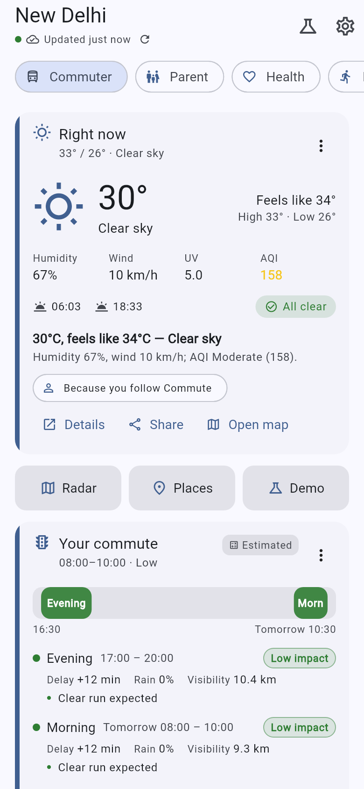 |  |

| Fitness | Beach | Agriculture |
|---|---|---|
| 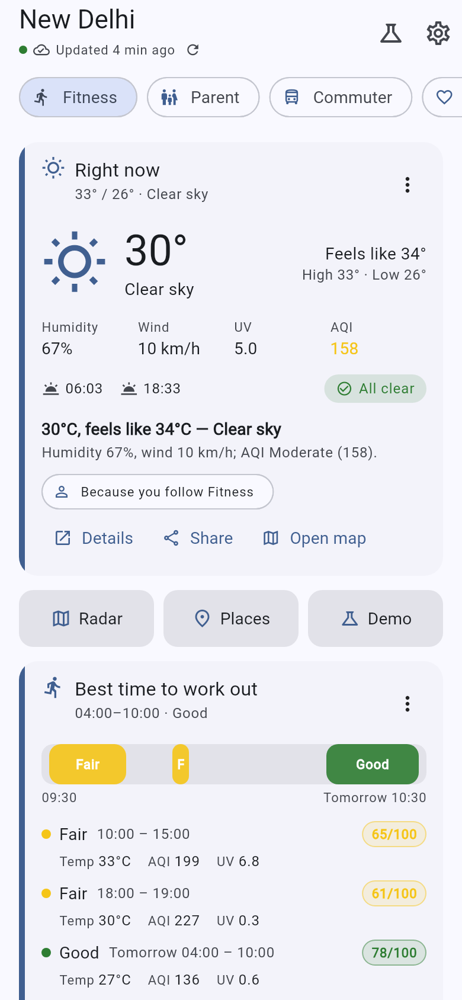 | 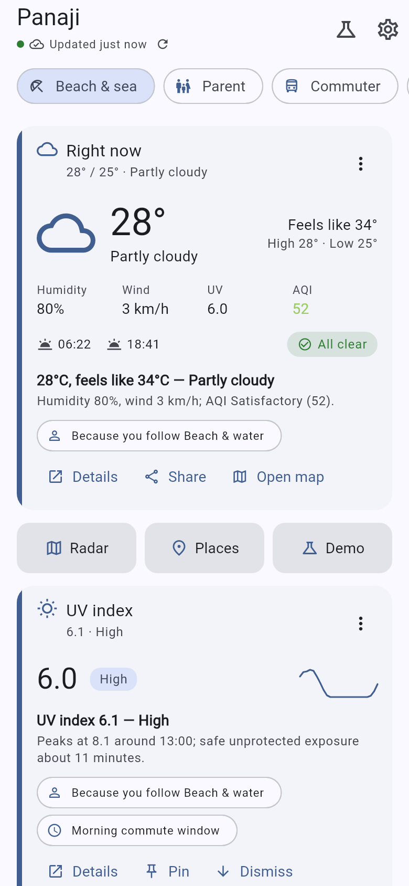 | 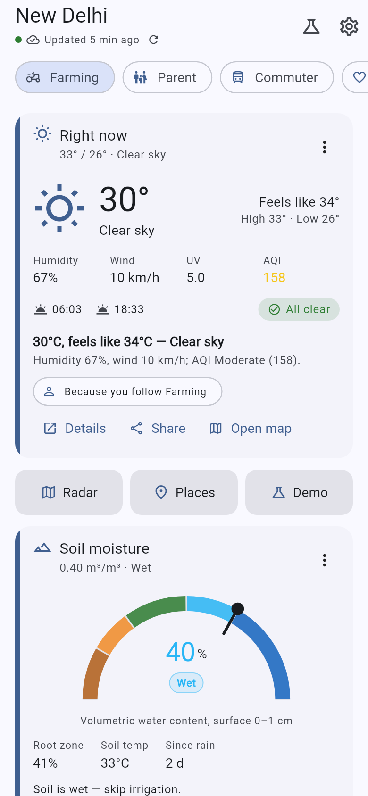 |

| Traveller | Event planner | Offline (cache) |
|---|---|---|
| 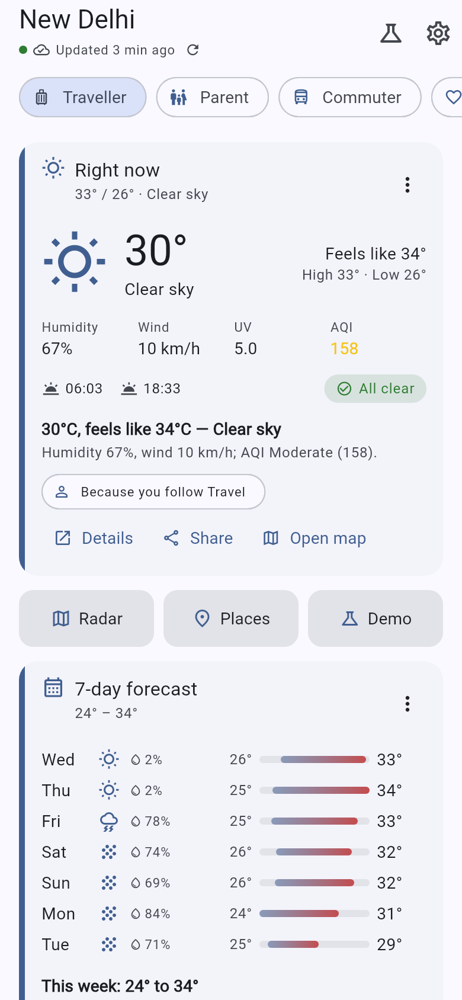 | 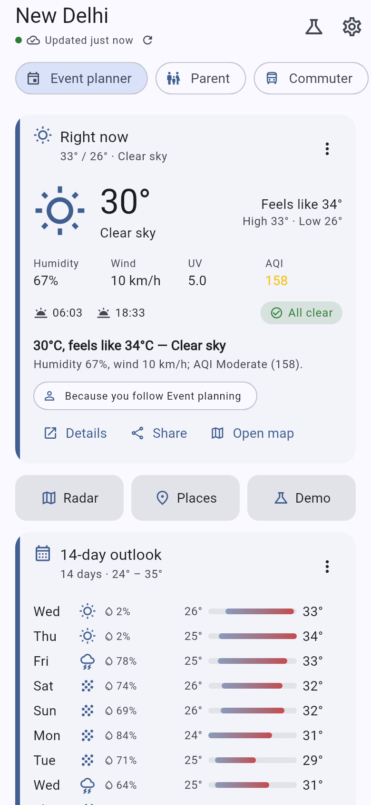 |  |

**Live re-rank and the rest of the app:**

| Before the warning is pushed | …seconds later, re-ranked | Hindi (`lang=hi`) |
|---|---|---|
| 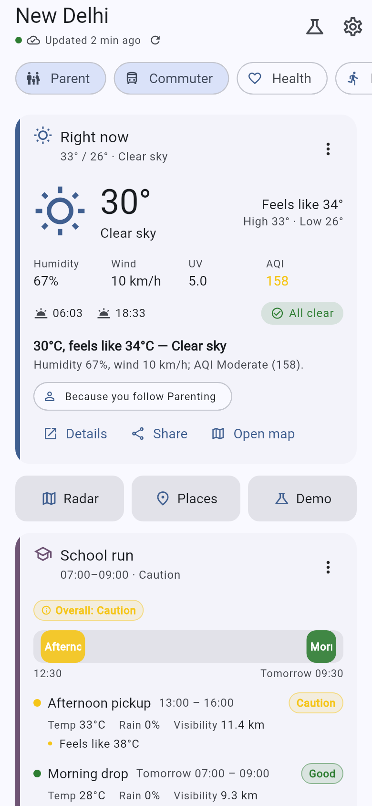 |  | 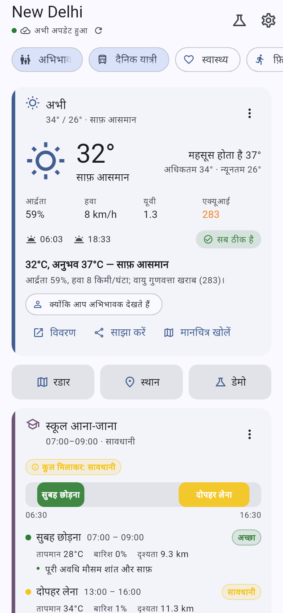 |

| Radar map | Saved places | Demo sheet |
|---|---|---|
| 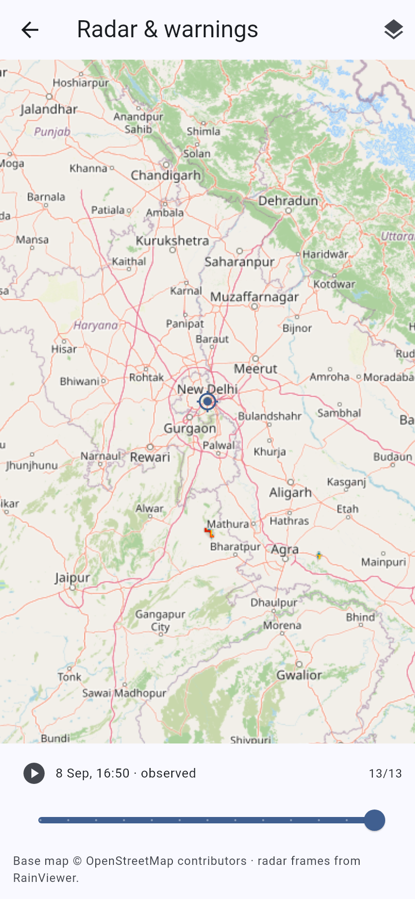 | 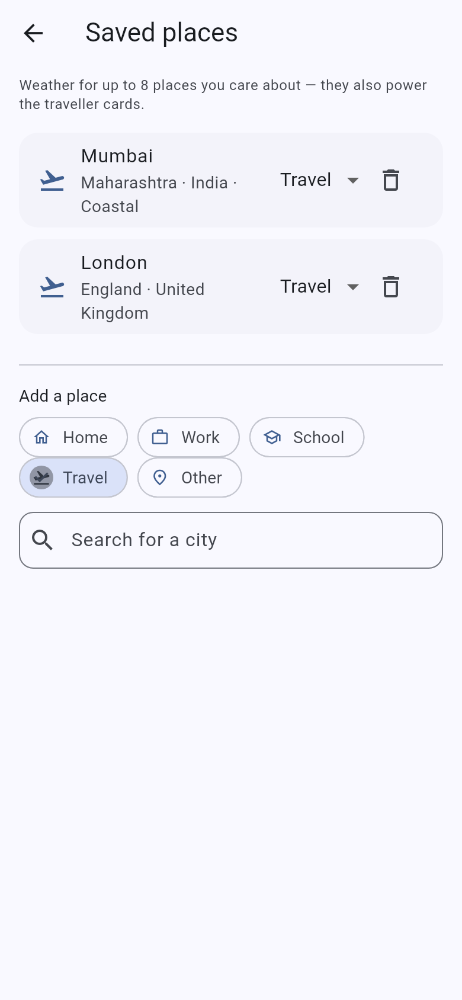 | 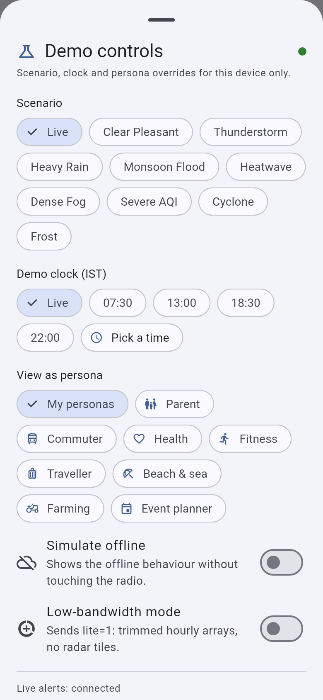 |

All shots are the Flutter web build driven against a locally running backend, except the offline
one (backend killed, rendering from the on-device cache). The `c1_*` set is the end-to-end QA walk
in [`docs/QA_REPORT.md`](docs/QA_REPORT.md) — 40 shots, one per demo step and variant;
`docs/screenshots/` also holds earlier per-phase shots and scrolled variants (`b2a_*_scrolled.png`).

## Architecture

```
┌──────────────── Flutter app (Android / iOS / web) ─────────────────┐
│ Onboarding → Home (ranked cards) → Detail pages → Map → Places      │
│ Riverpod · Dio · JSON file cache (offline) · WS client · ARB i18n   │
└──────────────▲──────────────────────────────────────▲──────────────┘
               │ REST  /api/v1  (JSON, < 60 KB)        │ WS /ws/alerts
┌──────────────┴──────────────────────────────────────┴──────────────┐
│ FastAPI backend                                                     │
│  api/       health · locations · weather · auth · me · home ·       │
│             events · admin · ws                                     │
│  engine/    catalog (33 cards, affinities, gates, multipliers)      │
│             → context → scoring → explain → learning → builders     │
│  services/  snapshot assembly + derived metrics (CPCB AQI, comfort, │
│             workout windows, school run, commute, frost, packing,   │
│             planting, tides*, pollen*, traffic*)      *estimated    │
│  providers/ IMD (whitelist-aware) → Open-Meteo → scenario/mock      │
│             + RainViewer radar + geocoding                          │
│  core/      TTL cache · SQLite (Postgres via env) · JWT · i18n      │
│  static/    admin demo console (scenarios, demo clock, push warning)│
└─────────────────────────────────────────────────────────────────────┘
```

**Request path:** `GET /home` → snapshot (cached upstream calls) → derived metrics → engine
(relevance × context + urgency + learning) → localized card payloads → `pinned` / `hero` / `cards` /
`more_cards`. Measured on an M1 MacBook Air: warm `/home` **2 ms** server-side, **~15 ms** on the
first request for a location (snapshot cache cold), payload **34.5 KB** (**13.5 KB** under `lite=1`)
against the < 60 KB / < 400 ms p95 targets in docs/01. The app never computes ranking itself, so IMD
could add or reorder a card **without an app release**.

### Data sources

| Source | Status | Used for |
|---|---|---|
| IMD `current_wx_api` · `nowcastapi` · `warnings_district_api` · `aws_data_api` | **needs IP/domain whitelisting** — returns `401` otherwise; the provider detects this, backs off for 10 min and falls through | station observations, 3-h nowcast, district colour-coded warnings |
| Open-Meteo forecast | keyless, 200 | current/hourly/daily, UV, visibility, soil moisture & temperature, sunrise/sunset, 16-day |
| Open-Meteo air quality | keyless, 200 | PM2.5, PM10, O₃, NO₂, SO₂, CO (→ **CPCB** AQI scale) |
| Open-Meteo marine | keyless, 200 | wave height/period/direction, swell, sea-surface temperature |
| Open-Meteo geocoding · BigDataCloud reverse geocoding | keyless, 200 | place search (India ranked first), lat/lon → district/state |
| RainViewer | keyless, 200 | radar frames + tiles (past + nowcast) |
| CPCB via data.gov.in · TomTom traffic | optional, need a free key | station AQI / real traffic flow; **estimated** without them |

Provider chain per field is **IMD → Open-Meteo → estimated**, and every value records its `source`.
Details and probe results: [`docs/01_ARCHITECTURE.md`](docs/01_ARCHITECTURE.md).

### Repo map

```
CLAUDE.md                 working rules for contributors: scope, verification, commit protocol
docs/                     THE PLAN — specs are normative, code follows docs
  00_VISION.md            problem statement, personas, principles, judge demo script
  01_ARCHITECTURE.md      stack decisions, data sources, deployment
  02_CARD_CATALOG.md      all 33 cards: affinities, data, insight + urgency rules
  03_PERSONALIZATION_ENGINE.md  scoring formulas, explainability, learning
  04_API_CONTRACT.md      REST + WebSocket contract (normative)
  05_BACKEND_SPEC.md      FastAPI structure, providers, derived-metric formulas
  06_MOBILE_SPEC.md       Flutter structure, screens, renderers, offline, i18n
  07_PHASES.md            phase-by-phase work packages
  08_PITCH.md             SIH idea-presentation content (problem → future scope)
  09_PUSH_NOTIFICATIONS.md  FCM push design (S3): why the WebSocket is not enough, the
                          transport swap, message schema, device registry, rollout checklist
  QA_REPORT.md            end-to-end walk of the judge demo script — verdict PASS
  TeamMausam_SIH2026_PS26076.pptx   the 6-slide SIH deck, generated from 08_PITCH.md
  PROGRESS.md             living checklist + per-phase handover notes
  HANDOFF.md              how to continue this repo cold
  SETUP_WINDOWS.md        Windows toolchain setup
  fixtures/               example /home payloads (8 personas + severe + coastal)
  screenshots/            the images above
backend/                  FastAPI service (Python 3.13) — see backend/README.md
app/                      Flutter app (package `mausam_app`)
infra/                    docker-compose.yml, render.yaml
scripts/                  toolchain setup (Windows) + optional Android emulator (.ps1 and .sh)
.github/workflows/        CI: backend pytest (offline) · flutter analyze/test/APK/web
```

---

## Run it yourself

Nothing here needs an API key, a Docker daemon or a database server. **Python 3.13** for the
backend, **Flutter stable (3.47.x)** for the app.

### 1. Backend

```bash
cd backend
python -m venv .venv
.venv/bin/python -m pip install -r requirements-dev.txt   # Windows: .venv\Scripts\python
.venv/bin/python -m pytest -q                             # → 348 passed (fully offline)
.venv/bin/python -m uvicorn app.main:app --reload --port 8000
```

| What | URL |
|---|---|
| Health | <http://localhost:8000/api/v1/health> |
| OpenAPI docs | <http://localhost:8000/docs> |
| **Admin demo console** | <http://localhost:8000/admin/console> — paste the admin key `mausam-admin` and press **Save** |
| Live alerts | `ws://localhost:8000/ws/alerts?token=&lat=28.61&lon=77.21` |

Routers are mounted at `/api/v1` **and** at the root, so `curl http://localhost:8000/health` works
too. SQLite is created on first boot at `backend/data/mausam.db`. Config, env vars and the Docker /
Render deploy path: [`backend/README.md`](backend/README.md).

Smoke test with a guest token:

```bash
TOKEN=$(curl -s -X POST http://localhost:8000/api/v1/auth/guest | python3 -c "import sys,json;print(json.load(sys.stdin)['token'])")
curl -s -H "Authorization: Bearer $TOKEN" \
  "http://localhost:8000/api/v1/home?lat=28.61&lon=77.21&personas=parent,commuter&now_override=$(date +%F)T07:30:00+05:30"
```

`$(date +%F)` is deliberate — the demo clock has to land inside the 48-h forecast window or the
*ranking* moves while the *reading* stays on the live observation (see [Judge demo
script](#judge-demo-script-5-minutes)). A hardcoded date makes the clock look like it does nothing.

### 2. App

**Never used Flutter before?** Install the SDK once —
<https://docs.flutter.dev/get-started/install> — pick **stable 3.47.x**, then run
`flutter doctor`. For option (a) you only need the **Chrome** tick; options (b)–(d) also need the
**Android toolchain** tick (Android Studio's SDK + a JDK 17; `flutter doctor --android-licenses`
accepts the licences). Nothing below needs administrator rights except the emulator's one-time
virtualization step in (d).

```bash
cd app
flutter pub get
flutter analyze          # "No issues found!"
flutter test             # 103 green, incl. the fixture contract test
```

**(a) Chrome — the fastest loop, no Android toolchain.**

```bash
cd app && flutter run -d chrome
```

Press `r` to hot-reload, `R` to restart, `q` to quit. The default backend URL is
`http://localhost:8000`; if the app shows "Sample data" it could not reach the backend — start it
(step 1) or fix **Settings → Backend URL**.

**(b) A real Android phone over USB — the best demo.**

1. On the phone: **Settings → About phone → tap "Build number" seven times** to unlock
   *Developer options*, then **Developer options → USB debugging → on**.
2. Plug it into the laptop with a **data** cable and accept the *Allow USB debugging?* RSA prompt
   on the phone (tick "always allow").
3. Check the laptop can see it, then run:

```bash
cd app && flutter devices        # your handset should be listed, e.g. "SM_A155F (mobile)"
cd app && flutter run            # or: flutter run -d <device-id> when more than one is attached
```

If `flutter devices` shows nothing, re-plug the cable, confirm the prompt on screen, and run
`adb devices` (`unauthorized` = the prompt was not accepted; `no permissions` on Linux = add the
udev rule). Then set **Settings → Backend URL** in the app to `http://<your-laptop-LAN-IP>:8000`
(see (f)) — a phone cannot reach the laptop's `localhost`.

**(c) Install the APK directly** (no Flutter toolchain on the machine that installs it).

*From CI, no build needed:* open the repo's
[**Actions → flutter**](https://github.com/Shreyansh303/team_mausam_sih_2026/actions/workflows/flutter.yml)
run for the commit you want → **Artifacts → `app-release-apk`** → download and unzip →
`app-release.apk`. (GitHub requires you to be signed in to download artifacts.)

*Or build it yourself:*

```bash
cd app && flutter build apk --release      # ~2 min warm; debug signing, fine for a demo
# → app/build/app/outputs/flutter-apk/app-release.apk   (62.5 MB, all ABIs)
adb install -r build/app/outputs/flutter-apk/app-release.apk
# a debug build also works and is what you want for logs:
cd app && flutter build apk --debug        # → app-debug.apk (~168 MB)
```

To install without `adb`, copy the `.apk` to the phone and open it — Android asks you to allow
"install unknown apps" for the file manager first. The app is signed with the **debug** key
(`flutter build apk --release` falls back to it when no keystore is configured), so it installs
side-by-side with nothing and can be uninstalled normally.

*To sign it with your own key* (needed only to publish), create a keystore **outside the repo** and
point `app/android/key.properties` at it — both are gitignored, and `app/android/app/build.gradle.kts`
picks the key up on the next `--release` build (it prints a warning when the file is absent):

```bash
keytool -genkey -v -keystore ~/mausam-release.jks -keyalg RSA -keysize 2048 -validity 10000 -alias mausam
# app/android/key.properties — storeFile absolute, or relative to app/android/app/
printf 'storeFile=%s\nstorePassword=CHANGEME\nkeyAlias=mausam\nkeyPassword=CHANGEME\n' ~/mausam-release.jks > app/android/key.properties
```

The first Gradle run downloads ~2.7 GB and takes several minutes. If the Gradle **wrapper** itself
fails to download its distribution, see the workaround in `docs/PROGRESS.md` → "Notes for next
phase → H0".

**(d) Android emulator — optional, and the least-travelled path.** It needs a ~1.5 GB system image
plus the emulator package, so skip it unless you have no phone. Helper scripts create and boot an
AVD called `mausam_pixel`:

```powershell
# Windows (PowerShell 5.1+)
.\scripts\setup_android_emulator.ps1      # sdkmanager: emulator + system image; avdmanager: AVD
.\scripts\run_emulator.ps1                # boots it and waits for sys.boot_completed
```

```bash
# macOS / Linux
./scripts/setup_android_emulator.sh       # picks arm64-v8a on Apple Silicon, x86_64 otherwise
./scripts/run_emulator.sh
```

```bash
cd app && flutter run -d emulator-5554    # backend URL: http://10.0.2.2:8000
```

**One-time administrator step for the emulator on Windows:** hardware acceleration needs the
**Windows Hypervisor Platform** feature (Windows Features, or
`dism /online /Enable-Feature /FeatureName:HypervisorPlatform /All` from an elevated prompt, then
reboot) **and** virtualization enabled in the BIOS/UEFI (Intel VT-x / AMD SVM). Without it the
emulator either refuses to start or is unusably slow. macOS needs nothing; Linux needs KVM
(`sudo apt install qemu-kvm`, add yourself to the `kvm` group). This is the only step in the whole
repo that asks for admin rights — the setup script's header repeats it.

**(e) iOS** builds and simulators require **macOS with Xcode** (plus CocoaPods and a simulator
runtime — `sudo gem install cocoapods`, and install a runtime from Xcode → Settings → Components).
The code is platform-neutral and `flutter run -d iphone` works once `flutter doctor` is happy about
Xcode, but there is no iOS build in CI and judges are expected to use the Android APK or Chrome.

**(f) Backend URL rules.** The app stores the backend **origin** only (it appends `/api/v1` and
derives `ws://`/`wss://` itself), and **Settings → Backend URL** overrides the default:

| Where the app runs | Backend URL |
|---|---|
| Flutter web / desktop on the same machine | `http://localhost:8000` |
| Android **emulator** on the same machine | `http://10.0.2.2:8000` |
| Real Android phone on the same Wi-Fi | `http://<laptop-LAN-IP>:8000` |
| Deployed backend | `https://<service>.onrender.com` |

Find the LAN IP with `ipconfig` (Windows, "IPv4 Address"), `ipconfig getifaddr en0` (macOS) or
`hostname -I` (Linux) — something like `192.168.1.23`. Start the backend so it listens on that
interface (`uvicorn app.main:app --host 0.0.0.0 --port 8000`), keep the phone on the **same Wi-Fi**,
and check `http://<laptop-LAN-IP>:8000/api/v1/health` in the phone's browser before blaming the app.
A firewall prompt on first run must be allowed for private networks. `CORS_ORIGINS=*` is the
default, so Flutter web works with no proxy.

**CI.** [`.github/workflows/backend.yml`](.github/workflows/backend.yml) runs the offline pytest
suite on every push/PR that touches `backend/`;
[`.github/workflows/flutter.yml`](.github/workflows/flutter.yml) runs `flutter analyze`,
`flutter test`, `flutter build apk --release` (uploading `app-release.apk` as an artifact) and
`flutter build web` on every push/PR that touches `app/`.

**OS differences in one line:** the venv interpreter is `backend/.venv/bin/python` on macOS/Linux
and `backend\.venv\Scripts\python.exe` on Windows; on Windows also read
[`docs/SETUP_WINDOWS.md`](docs/SETUP_WINDOWS.md) and `scripts/setup_flutter_windows.ps1` (user-space
toolchain install, no admin rights) plus `CLAUDE.md` §8 for the Gradle `TEMP` recipe. macOS/Linux
need none of that.

---

## Judge demo script (≈5 minutes)

Backend running, admin console open on a laptop, app open on a phone or in Chrome.

1. **Onboard** — language → pick **Parent + Commuter** → location **Delhi** (GPS, search or a
   popular city).
2. **Morning home** — set the demo clock to **07:30** (app demo sheet, admin console, or
   `?now_override=<today>T07:30:00+05:30`). Use **today's** date: the backend only moves the
   *reading* to a demo hour it has a forecast row for, and leaves the live observation standing
   otherwise, so a stale date makes the clock look like it does nothing. *School run* and
   *Commute conditions* rank first,
   each with its reasons; hero shows current conditions, nowcast and any rain alert below.
3. **Switch persona** — tap the **Fitness** chip: best workout window, sun times, wind and heat
   alert move up. Then **Health**: AQI, pollen, UV, humidity.
4. **Change location to Goa** — sea conditions, tides (**Estimated**) and water temperature appear;
   they are gated on the location being coastal.
5. **Push a warning** — admin console → preset **Orange thunderstorm — Delhi** → *Push warning*. The
   app receives `warning_issued` with `affects_you: true`, shows the banner and **animates the
   warning card to the top**. Delete the row to revert (or let its TTL expire).
6. **Show the learning** — long-press *Pollen* → *Why am I seeing this?* → *Show less*. Each tap
   subtracts from the card's score (docs/03: `0.25·tanh(x/8)`, so two taps are −0.16) and the sheet
   shows the running count; keep tapping until it drops into "More for you" — **two taps move it,
   three usually push it over**, because how far it has to fall depends on the cards around it.
   *Pin* is the instant one: the card jumps to the top on the next refresh, *Unpin* puts it back.
7. **Offline** — airplane mode: the home still renders from cache with "Updated N min ago".
8. **Hindi** — switch language; chrome *and* card copy/insights are localized.
9. **Traveller** — saved places Mumbai + London → packing suggestions ("Carry a raincoat in
   London") and flight-risk alerts.
10. Close on the architecture: server-driven cards, provider fallback chain, explainable engine.

**Scenario overlays** replace live weather with a scripted situation — `heatwave`, `cyclone`,
`dense_fog`, `frost`, `severe_aqi`, `thunderstorm`, `heavy_rain`, `monsoon_flood`, `clear_pleasant`,
`live`. Set one globally from the admin console, or per request:

```bash
# scenario + demo clock on a single request (both also accepted by /weather/snapshot)
curl -s -H "Authorization: Bearer $TOKEN" \
  "http://localhost:8000/api/v1/home?lat=28.61&lon=77.21&personas=commuter&scenario=dense_fog"
curl -s -H "Authorization: Bearer $TOKEN" \
  "http://localhost:8000/api/v1/home?lat=28.61&lon=77.21&personas=parent&now_override=$(date +%F)T07:30:00+05:30"
```

`now_override` is ISO-8601; a value without an offset is read as IST. `POST /admin/now-override`
with `{"now": null}` clears the demo clock. Keep the date inside the 48-h forecast window — today
or tomorrow: outside it the *ranking* still moves but the reading stays on the live observation
rather than inventing one (the app's demo sheet builds its presets on today for this reason). Full script: [`docs/00_VISION.md`](docs/00_VISION.md).

---

## API at a glance

Base URL `{BACKEND}/api/v1`. JSON UTF-8, metric units, times ISO-8601 **in the location's**
timezone. Auth is `Authorization: Bearer <jwt>` (guest or OTP user). Contract:
[`docs/04_API_CONTRACT.md`](docs/04_API_CONTRACT.md) — it is normative for both sides.

| Method | Path | Auth | Purpose |
|---|---|---|---|
| GET | `/health` | – | status, version, provider availability, active scenario + demo clock |
| POST | `/auth/guest` · `/auth/request-otp` · `/auth/verify-otp` | – | JWT guest / demo OTP (`123456`), guest merge |
| GET/PUT | `/me` · `/me/profile` · `/me/card-prefs` · `/me/places` | ✓ | profile, personas, pins/hides, saved places (max 8) |
| POST | `/me/reset-learning` | ✓ | clear engagement + prefs |
| GET | `/locations/search` · `/locations/reverse` · `/locations/popular` | – | place search (India first), reverse geocode, curated cities |
| **GET** | **`/home`** | ✓ | **the personalized home** — `lat`/`lon` or `place_id`, `lang`, `personas`, `now_override`, `scenario`, `event_date`, `lite=1` |
| GET | `/weather/snapshot` · `/weather/radar` · `/weather/scenarios` | – | full snapshot, RainViewer frames, scenario list |
| POST | `/events` | ✓ | engagement batch ≤ 100 (`impression, tap, expand, dismiss, pin, unpin, hide, unhide`) |
| GET/POST/DELETE | `/admin/state` · `/admin/scenario` · `/admin/now-override` · `/admin/warnings[/{id}]` · `/admin/reset-user` | `X-Admin-Key` | demo control; pushing/clearing a warning broadcasts on the WebSocket |
| GET | `/admin/console` | – | the single-file demo console (asks for the key itself) |
| WS | `/ws/alerts?token=&lat=&lon=` | ✓ | live alerts |

`/home` returns `{generated_at, location, context, banner, pinned[], hero, cards[], more_cards[],
hidden_types[], freshness, sources, engine}`; each `Card` carries `type, title, subtitle, size,
renderer, urgency, severity, score, reasons[], insight, data, actions[], personas[], source,
estimated`.

**WebSocket messages.** Server → client: `hello`, `ping` (every 30 s), `warning_issued` (with
`affects_you` computed from the client's coordinates), `warning_cleared`, `scenario_changed`,
`now_override`. Client → server: `pong` and `{"type":"location","lat":…,"lon":…}`. The app re-fetches
`/home` and animates the diff on `warning_issued && affects_you`, `scenario_changed` and
`now_override`; unknown types are ignored so the server can add more.

## Personalization engine in 10 lines

Pure, deterministic Python in `backend/app/engine/` — no I/O, so it is fully unit-tested
([`docs/03_PERSONALIZATION_ENGINE.md`](docs/03_PERSONALIZATION_ENGINE.md)).

1. **Gate** — drop cards the user hid, and cards whose precondition fails (coastal for tides, an
   active warning for the warnings card, a saved place for packing, `feels_like ≥ 35` for heat).
2. **Relevance** — the strongest persona affinity for the card, plus 15 % of the other personas'
   contributions (so a Parent + Commuter sees genuinely blended cards, not two stacked lists).
3. **Context multiplier** — time of day × season, clamped to 0.4–1.6: the school run ×1.5 at dawn on
   a weekday, AQI ×1.2 in winter, tides never at midnight.
4. **Urgency** — computed from the data itself: AQI Very Poor 0.75, red heatwave warning 1.0, dense
   fog 0.8, calm sea 0.
5. **Learning** — `0.25 · tanh((taps + 2·expands + 3·pins − 3·dismisses)/8)`, i.e. ±0.25.
6. **Score** = `0.5 · relevance · context + 0.5 · urgency + learning`.
7. **Pinned** = user-pinned, or urgency ≥ 0.8 — so an orange/red warning outranks every preference.
8. **Order** — pinned (by urgency) → `current_conditions` hero → top 8 by score → the rest into
   "More for you"; ties broken by catalog order, so the same input always produces the same screen.
9. **Explain** — up to four reasons per card from seven families (`persona:`, `urgency:`, `time:`,
   `season:`, `location:`, `engagement:`, `pinned:`), localized server-side.
10. **Test** — determinism, warning-pinning, coastal gating, persona switching, time-of-day, the
    dismiss/pin effect and per-persona coverage are all asserted in `backend/tests/`.

---

## Project status

| Phase | Scope | State |
|---|---|---|
| A1 | Backend data layer: providers, derived metrics, snapshot, city/coastal/planting data | ✅ done |
| A2 | Engine, 33 card builders, `/home`, auth, profile, places, events, en/hi i18n | ✅ done |
| A3 | Live alerts (`/ws/alerts`), admin console, Docker/Render, backend CI | ✅ done |
| B0 | Flutter toolchain + scaffold | ✅ done |
| B1 | App foundation: models, API client, cache, onboarding, home shell, 6 renderers | ✅ done |
| B2a | All 15 renderers + a detail page per renderer | ✅ done |
| B2b | Animations, events pipeline, why-sheet actions, places, map, settings, demo sheet, WS client, low-bandwidth, a11y, full l10n, icon/splash | ✅ done |
| B3 | Live-backend integration, backend i18n fixes, release APK, Flutter CI workflow | ✅ done |
| C1 | End-to-end QA against the judge demo script — **verdict PASS**, 9 defects found and fixed ([`docs/QA_REPORT.md`](docs/QA_REPORT.md)) | ✅ done |
| C2 | README pass, pitch content ([`docs/08_PITCH.md`](docs/08_PITCH.md)) and the SIH deck | ✅ done |
| S1–S4 | Stretch: ML ranker v2 · home-screen widget · FCM push · more languages | ⬜ |

**Last verified gates** (2026-09-09, macOS/Apple Silicon): backend `pytest -q` → **348 passed**
(offline — upstream payloads are replayed through `respx`, so CI needs no network or key); app
`flutter analyze` clean, `flutter test` → **103 passed**, `flutter build web` ✓. The release APK
(`app-release.apk`, **62 496 756 B**, 3 ABIs, minSdk 24 / targetSdk 36) was built and verified in
B3 and re-checked statically in C1; it has **not** been installed on a physical device — no phone
or emulator image is available on this machine, so everything on-screen in this repo was observed
in the **web build plus a static APK check**, never on a handset. The end-to-end walk of all ten
demo steps, ten scenarios, Hindi, offline, learning and low-bandwidth is
[`docs/QA_REPORT.md`](docs/QA_REPORT.md). The checklist is
[`docs/PROGRESS.md`](docs/PROGRESS.md) — it is the source of truth, not this table.

**Roadmap / stretch:** **S1** ML ranker v2 (logistic regression on logged events, blended as
`score += 0.2·(p_tap − 0.5)`, behind `ENGINE_ML=1`) · **S2** Android home-screen widget ·
**S3** FCM push as the production alert transport, the WebSocket being the demoable stand-in
([`docs/09_PUSH_NOTIFICATIONS.md`](docs/09_PUSH_NOTIFICATIONS.md) — backend transport, device
registry and design doc are done; the app wiring waits on a Firebase project) ·
**S4** more languages beyond en/hi/mr/ta/bn.

## IMD integration path

Every `https://mausam.imd.gov.in/api/*` endpoint answers `401 — your IP/domain needs to be
whitelisted` from a host IMD has not approved, so the prototype runs on Open-Meteo by default.
`providers/imd.py` is already written against the real endpoints and switches over the moment access
is granted:

1. Write to IMD (Data Supply / Web Services, or the nearest Regional Meteorological Centre) with the
   deployment's **static public IP or domain**, the organisation and purpose, the four endpoints
   used (`current_wx_api`, `nowcastapi`, `warnings_district_api`, `aws_data_api`), the request rate
   (this backend caches IMD responses for 10 minutes per station), and a contact. Ask for the
   **district id list** too — IMD does not publish it.
2. Keep `IMD_ENABLED=1` and fill the `district_id` values in `backend/app/data/imd_ids.json`
   (station ids for 35 cities are already there).
3. `GET /health` then reports `providers.imd = "available"`, snapshots record `sources.imd`, and IMD
   warnings merge **ahead of** scenario and admin ones.

Until then the chain is IMD → Open-Meteo → estimated, exactly as documented, and nothing in the demo
depends on IMD being reachable. Details: [`backend/README.md`](backend/README.md#imd-integration-needs-whitelisting).

## Team

**Team Mausam** — Smart India Hackathon 2026, problem statement **26076** (Ministry of Earth
Sciences / India Meteorological Department), category Software, theme Smart Automation.
Repository: <https://github.com/Shreyansh303/team_mausam_sih_2026>. Contributions are visible in the
git history. No licence file has been added yet, so no licence is granted; contact the team before
reusing the code.
