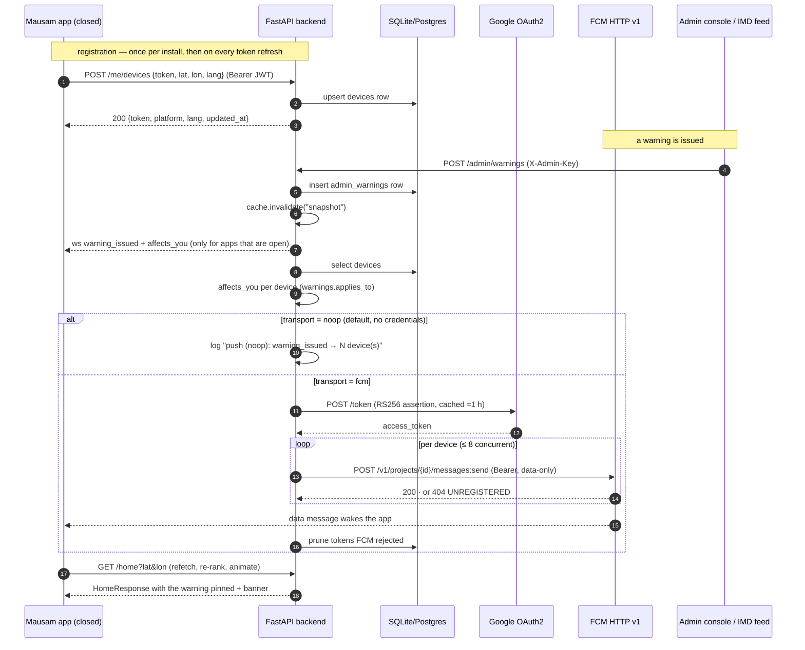

# 09 · Push notifications (FCM) — design

Status: **backend built, app wiring pending a Firebase project.** The transport, the device
registry and the message schema are implemented and tested in `backend/`; nothing in `app/`
depends on Firebase yet, and the default setup still needs **zero credentials**.

Related: `docs/04_API_CONTRACT.md` §Devices and §WebSocket · `docs/01_ARCHITECTURE.md` §Stack
("Live alerts: WebSocket … + FCM documented as production path") · `backend/app/services/push.py`
· `backend/README.md` §Push notifications (FCM).

## 1. Why the WebSocket is not enough

`/ws/alerts` is the right transport for the demo and the wrong one for a deployment:

| | WebSocket (`/ws/alerts`) | FCM push |
|---|---|---|
| App in the foreground | delivers in ~10 ms | delivers, but the socket is faster and free |
| App backgrounded | socket usually survives a few minutes, then the OS suspends it | delivers |
| App swiped away / phone asleep | **nothing** | delivers (Android: high-priority data wakes the app) |
| After a reboot | nothing until the user opens the app | delivers |
| Cost per idle user | one open TCP connection on the server | zero |
| Needs a Firebase project | no | yes |

A red warning that only reaches people who happen to have the app open is not a warning system.
Everything in this document exists to close that gap — **without** removing the WebSocket, which
is what makes the live re-rank visible in demo step 5 (`docs/00_VISION.md` §Judge demo script).
The two paths carry the *same* messages, and the app must tolerate receiving both (§6).

## 2. The transport swap

The server already had exactly one place where alerts fan out: `api/admin.py` writes the row,
drops the snapshot cache, then broadcasts. Push adds one line per broadcast — the same message also
goes to `services/push.py`:

```
POST /admin/warnings
  → admin_warnings.create(db)          # 1. write
  → cache.invalidate("snapshot")       # 2. the next /home sees it
  → ws.broadcast_warning(warning)      # 3. open apps  (unchanged)
  → push.notify_warning(db, warning)   # 4. closed apps (new)
```

`services/push.py` holds the whole feature:

```
PushTransport (Protocol)   name · async send(messages) -> PushResult
├── NoopTransport          default. Logs one INFO line per broadcast, sends nothing.
└── FcmTransport           FCM HTTP v1, data-only messages, OAuth2 service-account auth.
```

Selection is by environment and nothing else (`push.build_transport()`):

| `FCM_SERVICE_ACCOUNT_FILE` | `FCM_PROJECT_ID` | file exists | transport |
|---|---|---|---|
| unset | unset | – | `noop` |
| set | unset | – | `noop` |
| unset | set | – | `noop` |
| set | set | no | `noop` + a WARNING log line |
| set | set | yes | `fcm` |

`GET /health` reports which one is live: `"push": {"transport": "noop", "devices": 0}`.

A push failure — bad key, expired token, Google down — is caught in `push._deliver()`, logged and
swallowed. It must never turn an admin push into a 500 while the WebSocket path is working.

### Signing, without a Google SDK

`FcmTransport` does the documented two-legged flow with the libraries the backend already has
(PyJWT + httpx), so no Google SDK is pulled in:

1. build `{iss: client_email, scope: firebase.messaging, aud: token_uri, iat, exp}` and sign it
   RS256 with the service account's private key (`PyJWT[crypto]`);
2. `POST` the assertion to `token_uri` (`https://oauth2.googleapis.com/token`,
   `grant_type=urn:ietf:params:oauth:grant-type:jwt-bearer`) → an access token, cached in-process
   until 60 s before it expires;
3. `POST https://fcm.googleapis.com/v1/projects/{FCM_PROJECT_ID}/messages:send` per device with
   `Authorization: Bearer <access token>`. FCM v1 has no multicast in REST; sends run concurrently,
   capped at 8 in flight.

## 3. Message schema

Every message is **data-only** (no `notification` block). FCM `data` values must be strings, so
`null` is sent as `""` and objects as compact JSON.

`warning_issued` (the one that matters — the payload of 04 §WebSocket, flattened):

```jsonc
{"message": {
  "token": "<registration token>",
  "data": {
    "type":        "warning_issued",
    "warning":     "{\"id\":\"wrn_7a4734a416\",\"severity\":\"orange\", … }",  // the whole 04 Warning
    "affects_you": "true",                    // computed per device — §5
    "id":          "wrn_7a4734a416",          // the flat keys let the app build a tray
    "severity":    "orange",                  // notification without parsing `warning` first
    "hazard":      "thunderstorm",
    "title":       "Thunderstorm warning — Delhi",
    "color_hex":   "#F28C28"
  },
  "android": {"priority": "high"},
  "apns": {"headers": {"apns-priority": "5", "apns-push-type": "background"},
           "payload": {"aps": {"content-available": 1}}}
}}
```

The other three carry the same `data.type` names the socket uses, and nothing else:

| `data.type` | fields | app reaction |
|---|---|---|
| `warning_issued` | as above | if `affects_you == "true"`: raise a local notification, refetch `/home` |
| `warning_cleared` | `id` | drop the banner, refetch `/home` |
| `scenario_changed` | `scenario` | refetch `/home` (demo only) |
| `now_override` | `now` (`""` = cleared) | refetch `/home` (demo only) |

**Why data-only.** A `notification` block is rendered by the OS in whatever language the *server*
picked. This product ships five locales and a per-user language, and the app already has the
strings, so the app builds the notification itself from `data`. The cost is that the app must be
allowed to run briefly in the background (§6). Adding a `notification` block later is a two-line
change in `push.fcm_body()` if the team decides OS-rendered alerts are worth losing the
localisation.

The payload is ~700 bytes, well inside FCM's 4 KB data limit. A `Warning` is bounded by
`docs/04` (`description` ≤ 1000 chars); if a future field pushes it over, send only the flat keys
and let the app refetch `/home` for the rest.

## 4. Device registration

```
POST   /api/v1/me/devices            Bearer <jwt>   {token, platform, lat?, lon?, lang?}
DELETE /api/v1/me/devices/{token}    Bearer <jwt>   → {"ok": true}
GET    /api/v1/admin/devices         X-Admin-Key    → {transport, count, devices:[…redacted]}
```

`models/device.py` — one row per registration token:

| column | notes |
|---|---|
| `token` | primary key. FCM identifies the *install*, not the user |
| `user_id` | FK → `users.id`, `ON DELETE CASCADE` |
| `lat`, `lon` | last reported position — the input to `affects_you` |
| `lang` | which locale to notify in (defaults to the profile language) |
| `platform` | `android` \| `ios` \| `web` |
| `created_at`, `updated_at` | |

Rules:

* **Upsert.** Registering an existing token updates it in place. A token that reappears under a
  different account moves to that account — the handset changed hands, and the previous user must
  stop receiving that device's alerts.
* **Ownership.** `DELETE` only ever removes a token owned by the caller; someone else's token is a
  404, not a delete. Without that check, knowing a token would let anyone unsubscribe a stranger.
* **Cap.** 8 rows per user (`MAX_DEVICES_PER_USER`); the least recently updated is evicted.
  Reinstalls mint new tokens, so an uncapped registry grows forever.
* **Self-healing.** FCM answers `404 UNREGISTERED` (or a 400 naming the registration token) for a
  token belonging to an uninstalled app; `push.prune()` deletes those rows on the spot.

When to call it, from the app: after permission is granted on first run, on every
`onTokenRefresh`, when the user changes language or location, and `DELETE` on sign-out or when
notifications are turned off in Settings.

## 5. `affects_you`, per device

Identical rule to the socket (`services/warnings.applies_to`), just fed from the stored
coordinate instead of the connection's:

1. same **district** as the warning, or
2. same **state** when the hazard is `cyclone`, `heatwave` or `cold_wave`, or
3. within `radius_km` of the warning's `lat`/`lon` (haversine).

The district/state for a device are derived from `lat`/`lon` via the nearest curated city within
60 km — the same `NEAREST_CITY_KM` the WebSocket registry uses. A device that never sent a
position gets `affects_you: "false"`: the message still arrives (so the app can refresh silently)
but it must not raise an alarm for a place the server cannot locate.

Every device gets the message; only the flag differs. That is deliberate — a device 900 km away
still wants its `/home` to be right if it happens to be showing that location, and filtering
server-side would need a second index for a benefit that does not exist at this scale.

## 6. Delivery notes (Android / iOS)

**Android.** `priority: "high"` on a data message wakes a backgrounded — even Doze-idled — app
long enough to run the handler. Not delivered while the app is *force-stopped* (a user swipe from
Recents is fine; "Force stop" in Settings is not) and delayed on OEM battery managers (Xiaomi,
Oppo, Vivo are the usual suspects in India), so the app must still reconcile on resume by
refetching `/home` — never assume a push arrived. Android 13+ needs the runtime
`POST_NOTIFICATIONS` permission; a denied prompt must degrade to the in-app banner, not a dead end.

**iOS.** A background push (`content-available: 1`, `apns-push-type: background`,
`apns-priority: 5` — Apple rejects background pushes at priority 10) is *best effort*: the system
throttles it and drops it entirely for a force-quit app. For a red warning on iOS the message must
carry a `notification` block (or `apns.payload.aps.alert`) so the OS displays it without the app
running, which means the server picks the language — from `Device.lang`, which is why that column
exists. Add that when iOS is actually shipped; today the prototype is Android-first.

**Ordering.** Push and socket may both deliver the same warning. The app must key on
`warning.id`, ignore a duplicate, and ignore unknown `data.type` values so a later server can add
one (the same rule already applies to the WebSocket).

## 7. Sequence



## 8. Security

* **No credentials in the repo.** The service-account JSON is referenced by path only
  (`FCM_SERVICE_ACCOUNT_FILE`), never committed, never logged, never returned by an endpoint.
  `.env.example` and `infra/render.yaml` carry the variable names with empty values.
* **A registration token is a send-capability.** Anyone holding it can be targeted by anyone
  holding the FCM key. So: registration requires the user's bearer token; deletion is
  ownership-checked; `GET /admin/devices` and every log line show only the last six characters
  (`push.redact()`), and the token is echoed back only to the client that just sent it.
* **Admin auth is unchanged.** Only `X-Admin-Key` can cause a push, exactly as for the socket.
  Before a public deployment, `ADMIN_KEY` must be a generated secret (it is already
  `generateValue: true` in `infra/render.yaml`) — otherwise the push fan-out is an open megaphone.
* **TTL.** Warnings carry `ttl_minutes` (default 120) and the FCM message inherits nothing; a
  stale queued push is possible if a handset is offline for hours. Set `android.ttl` /
  `apns-expiration` from the warning's `valid_to` before shipping, so a warning cannot arrive
  after it has expired.
* **Rate.** One admin push = one message per registered device. At demo scale that is a handful;
  at IMD scale it is millions, which is a different design (§9).
* **Privacy.** The registry stores a coarse coordinate, a language and a platform per install —
  no phone number, no history. `ON DELETE CASCADE` removes a user's devices with the user.

## 9. What a full rollout still needs

1. **A Firebase project** — create it, add the Android app with id `com.teammausam.mausam_app`,
   download `google-services.json` (app) and a service-account key (backend). Steps in
   `backend/README.md` §Push notifications (FCM).
2. **App wiring** (deliberately *not* done here — adding `firebase_messaging` without a
   `google-services.json` breaks the APK build, and the file cannot be committed):
   `firebase_messaging` + `flutter_local_notifications`, request `POST_NOTIFICATIONS`, register
   the token against `/me/devices`, handle a `warning_issued` data message by refetching `/home`,
   and raise a localised local notification when `affects_you == "true"`.
3. **Topics instead of tokens at scale.** Per-district topics (`warn_delhi_new_delhi`,
   `warn_state_maharashtra`) turn a million sends into one, at the cost of computing
   `affects_you` on the device instead of the server. The registry stays for per-user targeting.
4. **A real trigger.** Today a push is an admin action. Production means polling the IMD district
   warnings API (`providers/imd.py`, already written) and pushing on *new* warning ids, with
   de-duplication so a re-issued warning does not re-notify.
5. **Delivery accounting.** Log message ids, count failures per batch, alert when the failure rate
   crosses a threshold. `PushResult` already returns `sent` / `failed` / `invalid_tokens`.
6. **Quiet hours and severity thresholds.** A yellow warning at 03:00 is how an app gets its
   notifications disabled. Yellow → in-app only, orange/red → push, with a user setting.
7. **Multi-instance.** The WebSocket registry is in-process (one instance, per
   `docs/01_ARCHITECTURE.md`); the device registry is in the database, so push already works
   across instances. Whichever instance receives the admin call does the sending.

## 10. Trying it without Firebase

The noop transport makes the whole path exercisable with no account:

```bash
cd backend && .venv/bin/python -m uvicorn app.main:app --port 8000   # (Windows: .venv\Scripts\python)
TOKEN=$(curl -s -X POST localhost:8000/api/v1/auth/guest | python -c "import sys,json;print(json.load(sys.stdin)['token'])")
curl -s -X POST localhost:8000/api/v1/me/devices -H "Authorization: Bearer $TOKEN" \
     -H 'Content-Type: application/json' \
     -d '{"token":"demo-device-000001","platform":"android","lat":28.61,"lon":77.21,"lang":"hi"}'
curl -s localhost:8000/health                                     # → "push": {"transport":"noop","devices":1}
curl -s -X POST localhost:8000/api/v1/admin/warnings -H 'X-Admin-Key: mausam-admin' \
     -H 'Content-Type: application/json' \
     -d '{"severity":"orange","hazard":"thunderstorm","title":"Thunderstorm — Delhi",
          "district":"New Delhi","state":"Delhi","lat":28.61,"lon":77.21,"radius_km":75}'
# server log: push (noop): warning_issued → 1 device(s), affects_you=true for 1
```

Tests: `backend/tests/test_push.py` (transport selection, registry + ownership, per-device
`affects_you`, the exact FCM v1 request, stale-token pruning). Google's endpoints are replayed
through `respx` and the RSA key is generated at run time, so the suite stays offline and
credential-free.
